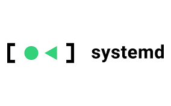
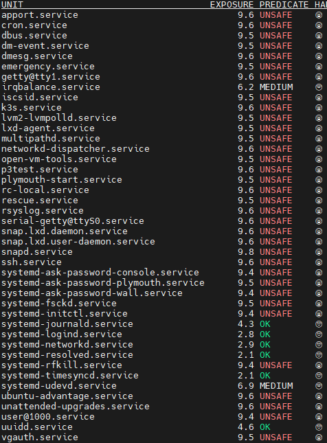

# Renforcement des services Systemd

Ceci est une démonstration de la puissance de **systemd**.
Depuis les dernières versions, **systemd** a implémenté des fonctionnalités intéressantes. Ces fonctionnalités concernent la sécurité, en particulier le sandboxing.
Le fichier `p3test.service` fournit certaines de ces directives rendues disponibles par **systemd**.
Les images montrent, étape par étape, comment renforcer le service en utilisant des directives spécifiques et les vérifier avec les outils systemd fournis.



## Débogage

Systemd a mis à disposition un outil intéressant nommé **systemd-analyze**.

La commande `systemd-analyze security` génère un rapport sur l'exposition à la sécurité pour chaque service présent dans notre distribution.



Cela nous permet de vérifier les améliorations appliquées à notre service **systemd**, directive par directive.

Comme vous pouvez le voir, la plupart des **services** sont actuellement marqués comme **UNSAFE**, probablement parce que toutes les applications n'appliquent pas encore les fonctionnalités rendues disponibles par **systemd**.

## Pour commencer

Commençons par une commande de base pour démarrer `python3 -m http.server` en tant que service :

=> sudo vi /etc/systemd/system/p3test.service
```
[Unit]
Description=Tâche qui exécute le démon python http.server
Documentation=https://docs.python.org/3/library/http.server.html

[Service]
Type=simple
ExecStart=/usr/bin/python3 -m http.server
ExecStop=/bin/kill -9 $MAINPID

[Install]
WantedBy=multi-user.target
```

```bash
sudo systemctl daemon-reload
sudo systemctl start p3test.service && sudo systemctl enable p3test.service
systemd-analyze security
```

En vérifiant l'exposition à la sécurité via `systemd-analyze security`, nous obtenons le résultat suivant :


La valeur de sécurité est actuellement de **9.6**/**10** et est marquée comme **UNSAFE**.

Voyons maintenant comment renforcer le service actuel pour le rendre plus sûr.

**N.B.** Toutes les directives suivantes ne seront pas utiles pour le service actuel. C'est juste une démonstration sur la façon de réduire l'exposition pour un service **systemd** générique.

## Directives Systemd pour le renforcement de la sécurité

Voici une explication détaillée de 21 directives Systemd couramment utilisées pour renforcer la sécurité des services :

1. `ProtectKernelTunables=yes`
   - Empêche la modification des paramètres du noyau
   - Rend en lecture seule les répertoires /proc/sys, /sys, /proc/sysrq-trigger, /proc/latency_stats, /proc/acpi, /proc/timer_stats, /proc/fs et /proc/irq

2. `ProtectKernelModules=yes`
   - Empêche le chargement ou le déchargement de modules du noyau
   - Renforce la sécurité du système en limitant les modifications du noyau

3. `ProtectControlGroups=yes`
   - Rend la hiérarchie du système de contrôle des groupes (cgroups) en lecture seule
   - Empêche les modifications non autorisées des cgroups

4. `PrivateDevices=yes`
   - Crée un /dev privé pour le service
   - Limite l'accès aux périphériques système

5. `RestrictSUIDSGID=true`
   - Empêche la création de nouveaux fichiers SUID/SGID
   - Réduit les risques d'escalade de privilèges

6. `IPAddressAllow=192.168.1.0/24`
   - Limite les connexions réseau du service à un sous-réseau spécifique
   - Dans cet exemple, seules les connexions du réseau 192.168.1.0/24 sont autorisées

7. `ProtectSystem=strict`
   - Rend les répertoires /usr, /boot et /efi en lecture seule
   - Rend /etc inaccessible
   - Protège les fichiers système critiques

8. `CapabilityBoundingSet=CAP_NET_BIND_SERVICE CAP_DAC_READ_SEARCH`
   - Limite les capacités du service à :
     - Lier des ports réseau inférieurs à 1024 (CAP_NET_BIND_SERVICE)
     - Contourner les vérifications de permission de lecture sur les fichiers et répertoires (CAP_DAC_READ_SEARCH)

9. `PrivateTmp=yes`
   - Crée un répertoire /tmp isolé pour le service
   - Empêche l'accès aux fichiers temporaires d'autres services ou du système
   - Réduit les risques de fuites d'informations ou d'attaques via des fichiers temporaires

10. `NoNewPrivileges=true`
    - Empêche le service et tous ses processus enfants d'obtenir de nouveaux privilèges via exec()
    - Limite efficacement les possibilités d'escalade de privilèges, même si le service est compromis

11. `RestrictNamespaces=uts ipc pid user cgroup`
    - Limite les espaces de noms (namespaces) que le service peut créer ou entrer :
      - `uts` : Empêche les changements de nom d'hôte
      - `ipc` : Restreint la communication inter-processus
      - `pid` : Limite la visibilité des processus
      - `user` : Empêche la création de nouveaux espaces de noms utilisateur
      - `cgroup` : Restreint la manipulation des cgroups
    - Renforce l'isolation du service en limitant sa capacité à interagir avec ou à modifier certains aspects du système

12. `ProtectHome=yes`
    - Rend les répertoires /home, /root et /run/user inaccessibles au service
    - Protège les données personnelles des utilisateurs

13. `ReadWritePaths=`
    - Spécifie les chemins auxquels le service a un accès en lecture et écriture
    - Tous les autres chemins seront en lecture seule

14. `MemoryDenyWriteExecute=yes`
    - Empêche la création de mémoire à la fois inscriptible et exécutable
    - Protège contre certaines formes d'attaques par injection de code

15. `SystemCallFilter=`
    - Permet de spécifier une liste d'appels système autorisés ou interdits
    - Limite les actions que le service peut effectuer au niveau du système

16. `RestrictAddressFamilies=`
    - Limite les familles d'adresses réseau que le service peut utiliser
    - Par exemple, `RestrictAddressFamilies=AF_INET AF_INET6` limiterait le service à IPv4 et IPv6

17. `LockPersonality=yes`
    - Empêche le service de changer le modèle d'exécution du noyau

18. `ProtectHostname=yes`
    - Empêche le service de modifier le nom d'hôte du système

19. `ProtectClock=yes`
    - Empêche le service de modifier l'horloge système

20. `ProtectKernelLogs=yes`
    - Empêche le service d'accéder aux journaux du noyau

21. `RestrictRealtime=yes`
    - Empêche le service d'obtenir un ordonnancement en temps réel

Ces directives supplémentaires peuvent être utilisées en fonction des besoins spécifiques de sécurité de votre service. Il est important de noter que certaines de ces restrictions peuvent interférer avec le fonctionnement normal de certains services. Il est donc recommandé de tester soigneusement chaque directive avant de l'appliquer en production.

N'oubliez pas que la sécurité est un processus continu. Il est important de rester informé des nouvelles fonctionnalités de sécurité de Systemd et d'ajuster vos configurations en conséquence.

L'utilisation combinée de ces directives crée un environnement d'exécution fortement restreint et sécurisé pour le service Systemd, limitant considérablement sa capacité à affecter ou être affecté par d'autres parties du système.

### Résultats finaux

Une fois que nous avons ajouté les autres directives au service, nous avons obtenu un service comme celui-ci : ```j'ai utilisé de 1 à 12 et de 17 à 20```

```
[Unit]
Description=Tâche qui exécute le démon python http.server
Documentation=https://docs.python.org/3/library/http.server.html

[Service]
Type=simple
ExecStart=/usr/bin/python3 -m http.server
ExecStop=/bin/kill -9 $MAINPID

# Fonctionnalités de sandboxing
PrivateTmp=yes
ProtectHome=yes
NoNewPrivileges=true
ProtectSystem=strict
CapabilityBoundingSet=CAP_NET_BIND_SERVICE CAP_DAC_READ_SEARCH
RestrictNamespaces=uts ipc pid user cgroup
ProtectKernelTunables=yes
ProtectKernelModules=yes
ProtectControlGroups=yes
PrivateDevices=yes
RestrictSUIDSGID=true
IPAddressAllow=192.168.1.0/24
LockPersonality=yes
ProtectHostname=yes
ProtectClock=yes
ProtectKernelLogs=yes
[Install]
WantedBy=multi-user.target
```
```bash
sudo systemctl daemon-reload
sudo systemctl restart p3test.service
systemd-analyze security
```

Atteignant un résultat vraiment intéressant :


Bien joué ! Nous avons obtenu un bon résultat en passant de **9.6** à **4.9**, sécurisant partiellement l'ensemble du système.

## Default safe

D'après les 21 options listées, voici celles utilisable facilement sans risques significatifs pour la plupart des services :

1. `ProtectKernelTunables=yes`
2. `ProtectKernelModules=yes`
3. `ProtectControlGroups=yes`
5. `RestrictSUIDSGID=true`
9. `PrivateTmp=yes`
10. `NoNewPrivileges=true`
12. `ProtectHome=yes`
17. `LockPersonality=yes`
18. `ProtectHostname=yes`
19. `ProtectClock=yes`
20. `ProtectKernelLogs=yes`
21. `RestrictRealtime=yes`

Ces 12 options renforcent la sécurité de manière significative sans généralement perturber le fonctionnement normal de la plupart des services. Elles limitent l'accès à des ressources sensibles du système et réduisent la surface d'attaque potentielle.
